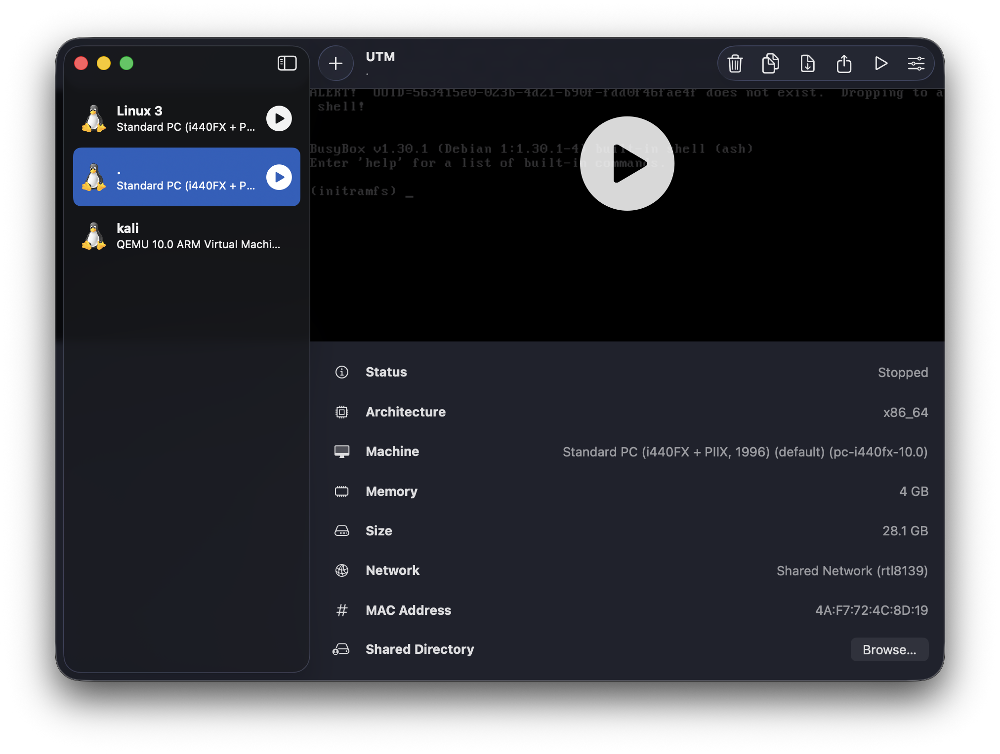
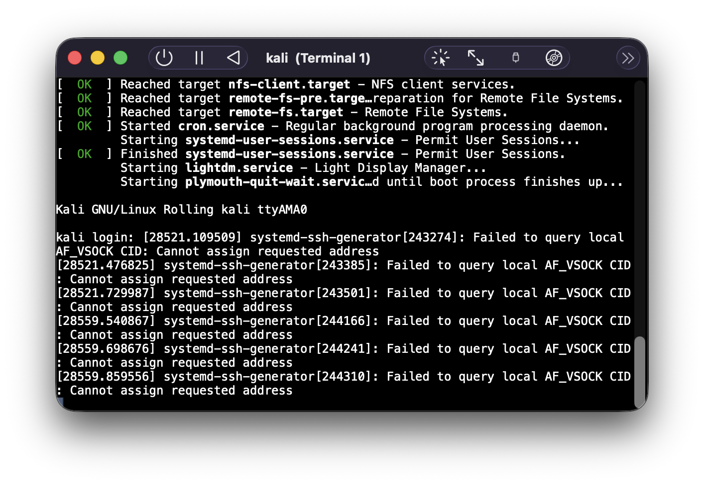
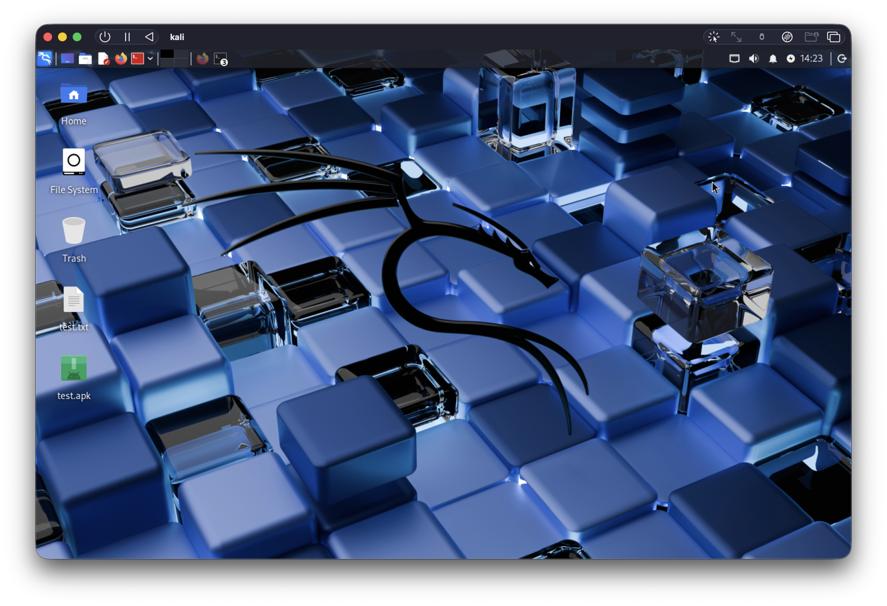
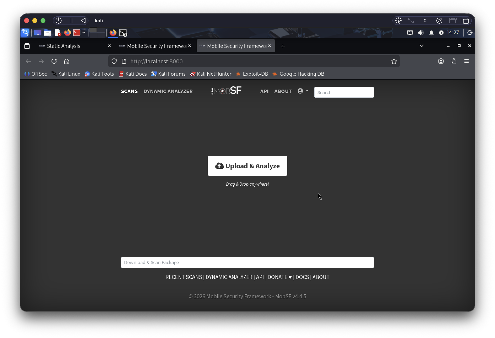
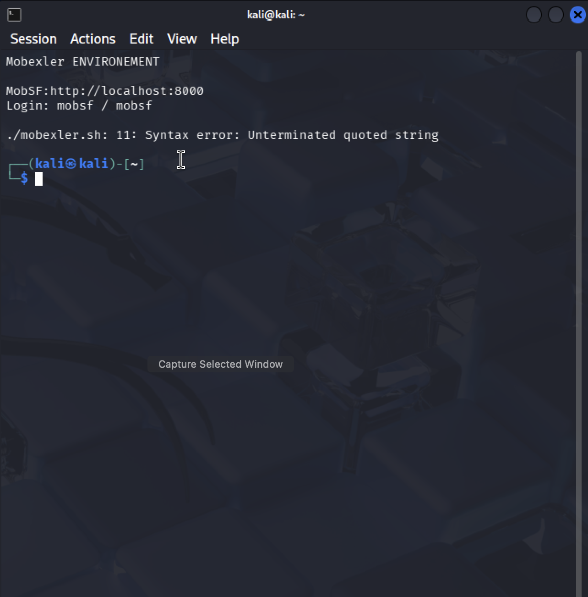
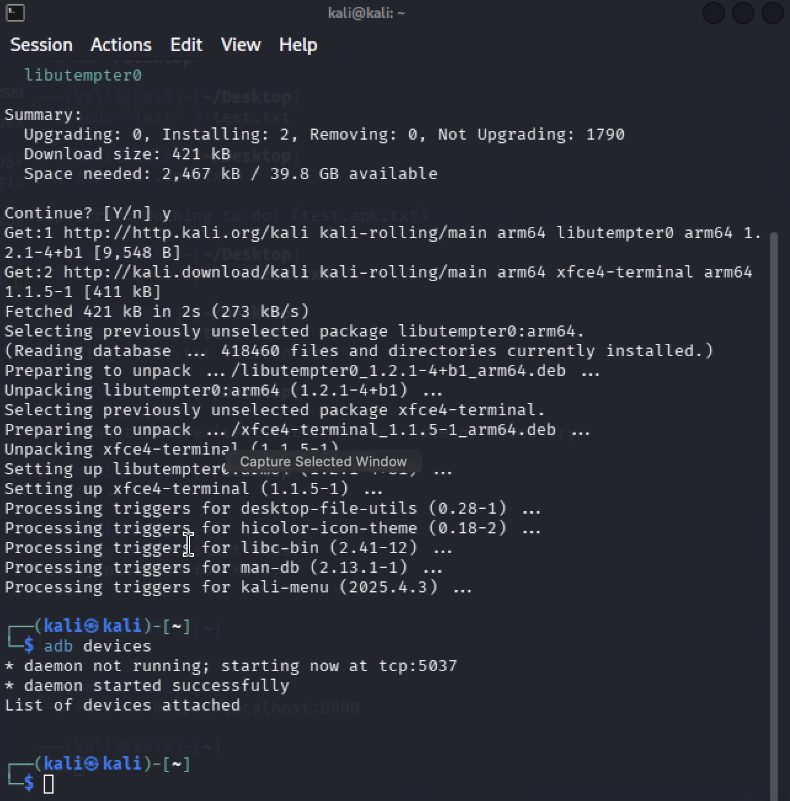

# 🚀 Installation Mobexler-like sur macOS Apple Silicon M2 ARM64

## 📱 Contexte du Projet
**Projet universitaire** : Installation d'un environnement de pentesting mobile équivalent à Mobexler sur MacBook M2 ARM64, car Mobexler officiel n'existe que pour x86_64.

---

## ⚠️ Problème Technique
**Mobexler n'existe pas pour ARM64** - seulement x86_64. L'émulation x86_64 sur Apple Silicon M2 est trop lente (5-10 FPS, interface inutilisable).

## 🎯 Solution Implémentée
**Environnement Mobexler-like natif ARM64** avec :
- ✅ Kali Linux ARM64 (UTM) - Interface graphique fluide
- ✅ MobSF - Interface web équivalente à Mobexler
- ✅ Tous les outils Mobexler (apktool, jadx, adb, frida, etc.)
- ✅ Performance native M2 (rapide et stable)

---

## 📦 PRÉREQUIS

### Matériel requis
- MacBook avec Apple Silicon (M2)
- 8GB RAM minimum (16GB recommandé)
- 10GB d'espace disque libre

### Logiciels requis
- **UTM** : `brew install --cask utm`
- **Homebrew** : [brew.sh](https://brew.sh)

---

## 🖼️ CAPTURES D'ÉCRAN DES ÉTAPES

### Étape 1 : Interface UTM - Création de la VM

### Étape 2 : Installation Kali ARM64

### Étape 3 : Bureau Kali ARM64

### Étape 4 : Interface MobSF

### Étape 5 : Terminal avec outils

### Étape 6 : ADB fonctionnel

